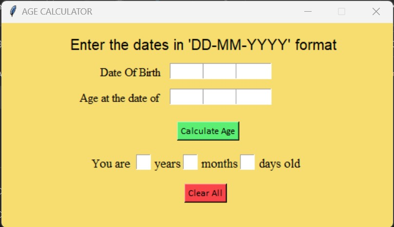
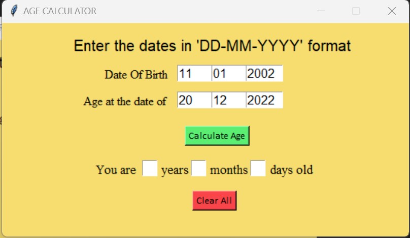
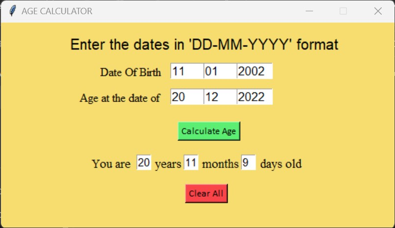
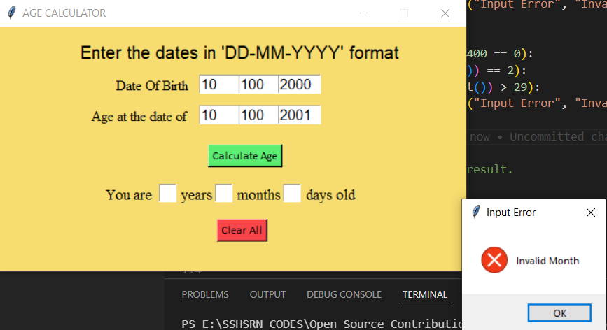
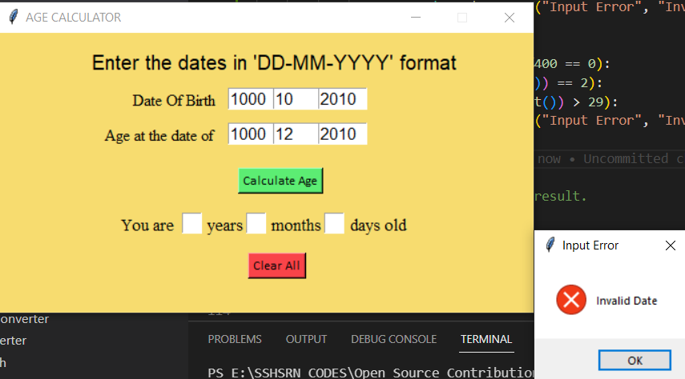
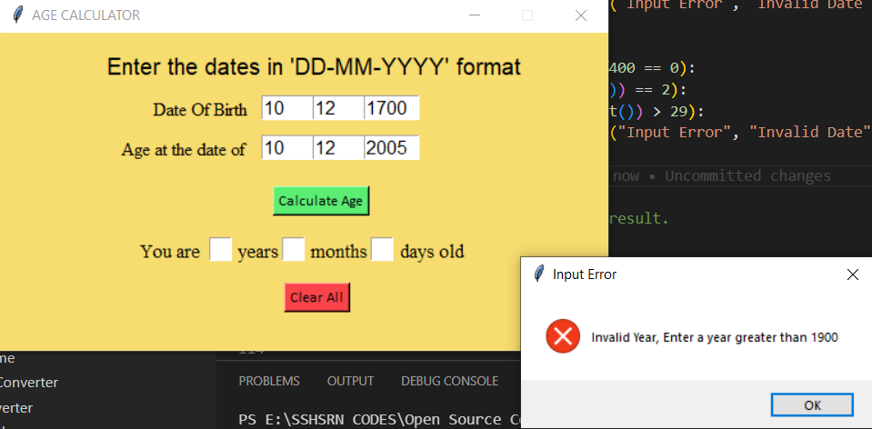
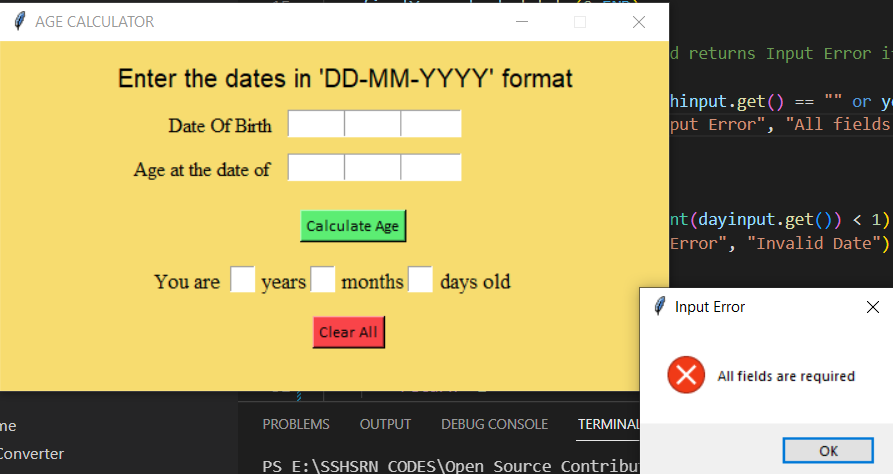

### AGE CALCULATOR

### GOAL

The goal of this project is to make a Age Calculator app.

### DESCRIPTION

I have mage this app using thinkter library. It can calculate your age as per the dates provided.

### WHAT I HAD DONE

1. Import Libraries - thinkter, messagebox and initialize it.
2. Defined a Clear function which clears all the data.
3. Defined CheckEntries function to check for a blank input.
4. Defined calculateAge functon to calculate the age as per the input provided.
5. Created labels, buttons and took inputs through built-in functions.
6. Used different fonts, and colour mode to make it attractive for GUI.

### LIBRARIES NEEDED

1. Thinkter: Provides built-in functions to create GUI.
2. Messagebox: It comes under thinkter library and it is used to create buttons.

### DEMONSTRATION

1. Image1 - First image shows the app preview.

2. Image2 - The user enter its date of birth and the age of the date to be calculated.

3. Image3 - It displays the calculated age.

4. Image4 - It shows the error message if the user enters a wrong month.

5. Image5 - It shows the error message if the user enters a wrong date.

6. Image6 - It shows the error message if the user enters a wrong year.

7. Image7 - It shows the error message if the user gives a blank input.

### YOUR NAME

### Abhay Chauhan
### Srihari S