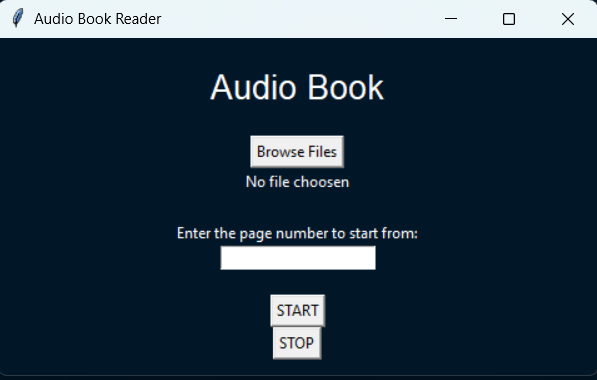

# AUDIO BOOK

# GOAL

This is an Audio book program written in python. It converts pdf file to audio books, by extracting all text in the pdf file and converting it into speech.

# DESCRIPTION

This is a python Audio book. 
The program extract all texts from the pdf file and convert it into speech.

## How to use:
+ Run the program
+ Click on Browse and select any pdf file(which have extractalbe text)
+ Enter the page number you want to start from in the page Entry
+ Click on start to start the Audio book
+ When your done listening click on stop to stop the Audio Book
+ Close the window

# WHAT I HAD DONE

The program is written in python.
It uses PyPDF2 to extract text from the pdf and then uses pyttsx3 to convert it into speech.It also tkinter for GUI and uses threading to run the function in an other thread to avoid freezing the GUI when the function runs.

# LIBRARIES NEEDED
+ Tkinter
+ pyttsx3
+ PyPDF2
+ Threading

# DEMONSTRATION 

https://user-images.githubusercontent.com/82754813/210595903-f70b9dae-13db-4cae-9685-9c8ffbac9dba.mp4

Mathew
