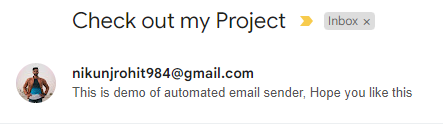

**Automatic Email Sender**

**GOAL**
Send email in one go by clicking the run button. 

**DESCRIPTION**
If person want to send same mail to many persons. this programme can help it.

**WHAT I HAD DONE**

1. set 2-step verifiaction
2. import some files like smtpib, ssl, EmailMessage
3. set Sender and recieve, subject.
4. send EmailMessage()

**LIBRARIES NEEDED**

smtpib, ssl, EmailMessage

**DEMONSTRATION**

**YOUR NAME**

Nikunj Rohit
Twitter: @nikunj_rohit10