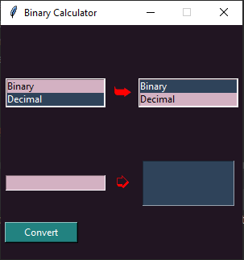
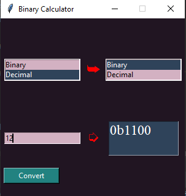
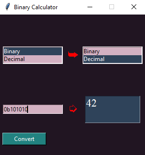

**Binary Calculator App**  

**GOAL**
Convert Decimal to Binary

**DESCRIPTION**
Binary Calculator app converts decimal to binary and also converts binary to decimal

**WHAT I HAD DONE**  
In this code, I implemented the code by using the following concepts:
+ Tkinter module

**DEMONSTRATION**  

### Keyvan Majidi ###
     [https://github.com/keyvanmj]
