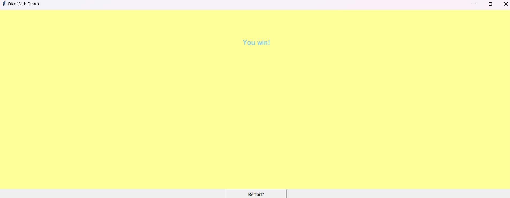
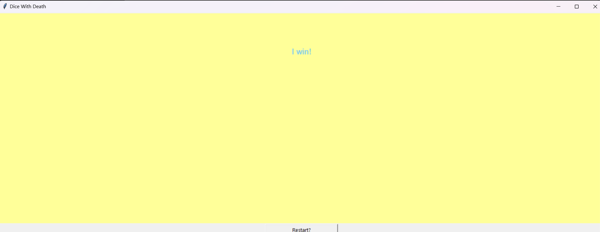
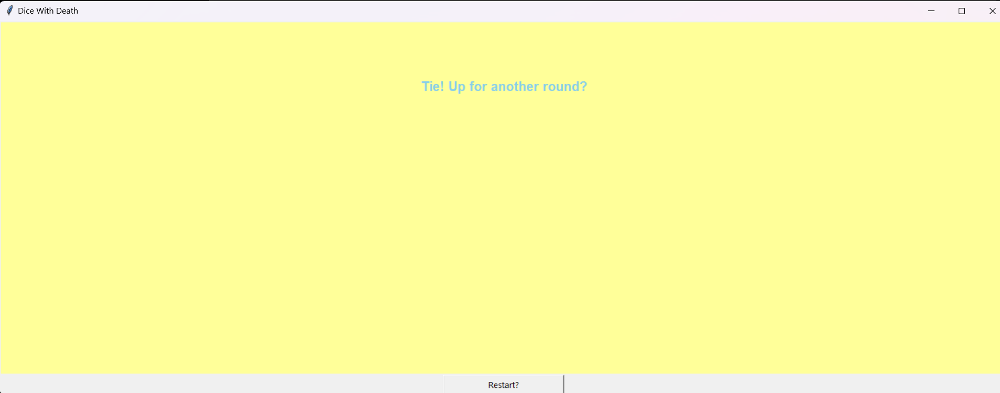

**DICE WITH DEATH**  
**AUTHOR: DEVIKA SINGH**

**WIN CONDITION**  
The Player score should be greater than the computer Score after each round to win

**DESCRIPTION**  
Dice with Death or Drop Dead is a Dice Game, and this is a simplified version of the real game(which has only the user and the computer as players).
User plays against the computer
Each Player gets 5 die at the starting of each round.
They roll all five of them on first round and all the not killed die in subsequent rounds.
If a die with value 2 or 5 is rolled, that die is "killed" or set aside for the round.
If in a turn a 2 or 5 is rolled then no score is added in this turn, else the sum of values rolled by each die are added to the score of the round.
The player keeps playing till all their die are "killed"

Then the next player starts playing.

The scores of both the players are compared and winner is decided by the larger score.
It is a fun short game. 

**WHAT I DID**  
First I decided the Game Design:
It had to be played on custom made GUI using Tkinter 

Computer Plays first by default with the same rules as player.

I made a function for player playing a roll of a dice.

A button for roll is made by me to give players something to interact with.
For each roll first it is decided if it is end of the turn with this roll or end of the round itself.
Then dice is rolled and its value displayed on screen.

I added a home screen with title and start button.

I added a simple winning message at the end.

For developers, console print code is left that gives details of computer's turn on the console.
**SCREENSHOTS**  

