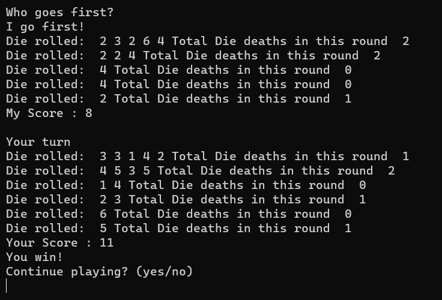

**DICE WITH DEATH**  
**AUTHOR: DEVIKA SINGH**

**WIN CONDITION**  
The Player score should be greater than the computer Score after each round to win

**DESCRIPTION**  
Dice with Death or Drop Dead is a Dice Game, and this is a simplified version of the real game(which has only the user and the computer as players).
User plays against the computer
Each Player gets 5 die at the starting of each round.
They roll all five of them on first round and all the not killed die in subsequent rounds.
If a die with value 2 or 5 is rolled, that die is "killed" or set aside for the round.
If in a turn a 2 or 5 is rolled then no score is added in this turn, else the sum of values rolled by each die are added to the score of the round.
The player keeps playing till all their die are "killed"

Then the next player starts playing.

The scores of both the players are compared and winner is decided by the larger score.
It is a fun short game.  

**WHAT I HAD DID**  
First I decided the Game Design:
It had to be played on the terminal

First I decided a normal roll of 5 die to determine who plays first by the greater sum of values rolled.

I made a function for player playing a round and used it for both players (user and the computer)

For each round first it is decided who goes first then both player play and then their scores are compared. Tie is a valid option.

I added clear screen after each round.

I added a simple greeting message at the end that stays for 1 second on the screen.
**SCREENSHOTS**  

