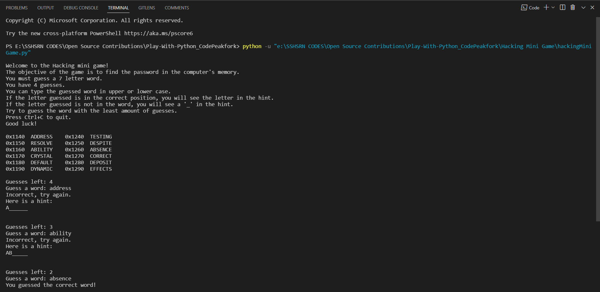
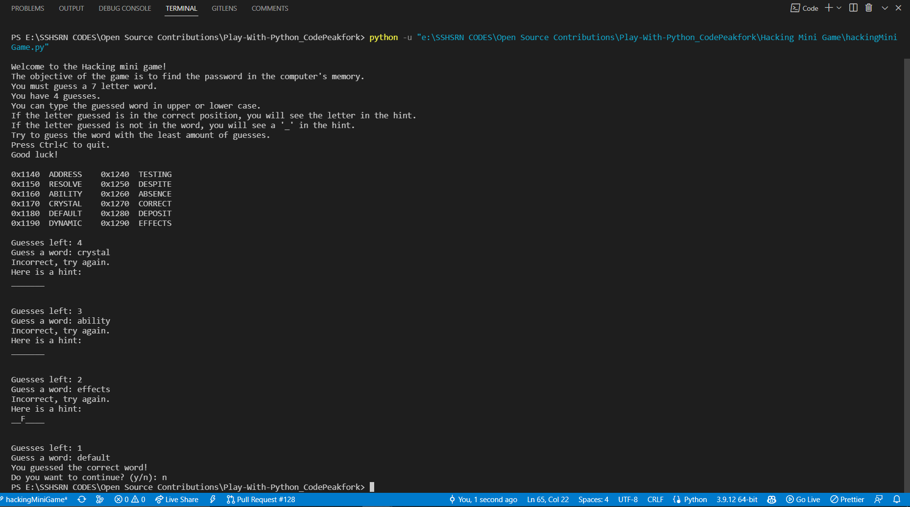

**HACKING MINI GAME**  

**GOAL**  
This is a simple word guess game created in python programming language.

**DESCRIPTION**  
The goal is to guess the correct word from a list of displayed words within 4 chances.

To play this game download hackingMiniGame.py and resources in the same directory. 
+ Open and run the file guess_number.py
+ enjoy the game :-D

**WHAT I HAD DONE**  
In this game, I implemented the game by using the following concepts:
+ Random module
+ While loop
+ If-else statement (conditional statements)
+ List
+ String
+ Functions

**DEMONSTRATION**  

I wish you enjoy guess this game :-D

**SRIHARI S**
