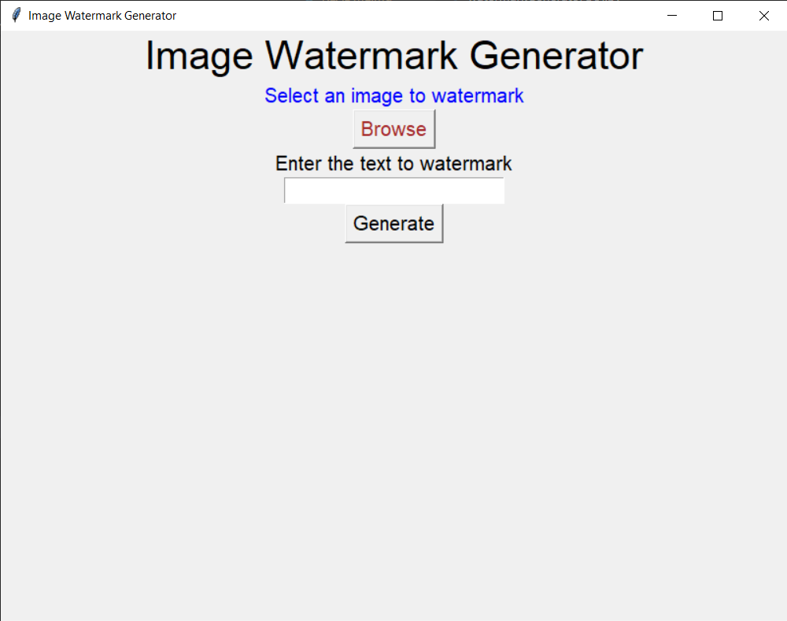
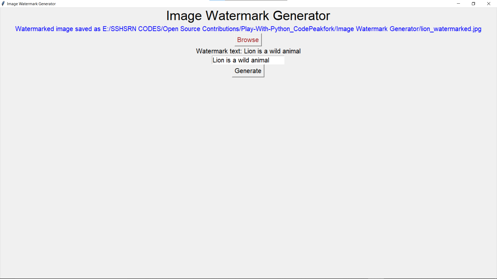

**WATERMARK GENERATOR**  

**GOAL**  
This is a simple watermark generator created in python programming language. You can add your own watermark to any image.

**DESCRIPTION**  
The goal is to add a watermark to any image irrespective of the image type and extension

To use this code download watermarkGenerator.py and resources in the same directory.
+ Open and run the file watermarkGenerator.py
+ enjoy the code :-D

To use the GUI version of this code, download watermarkGeneratorGUI.py and resources in the same directory.
+ Open and run the file watermarkGeneratorGUI.py
+ enjoy the code :-D

**WHAT I HAD DONE**  
In this code, I implemented the code by using the following concepts:
+ Pillow module
+ Tkinter module
+ os module

**DEMONSTRATION**  

I wish you enjoy guess this code :-D

**SRIHARI S**
