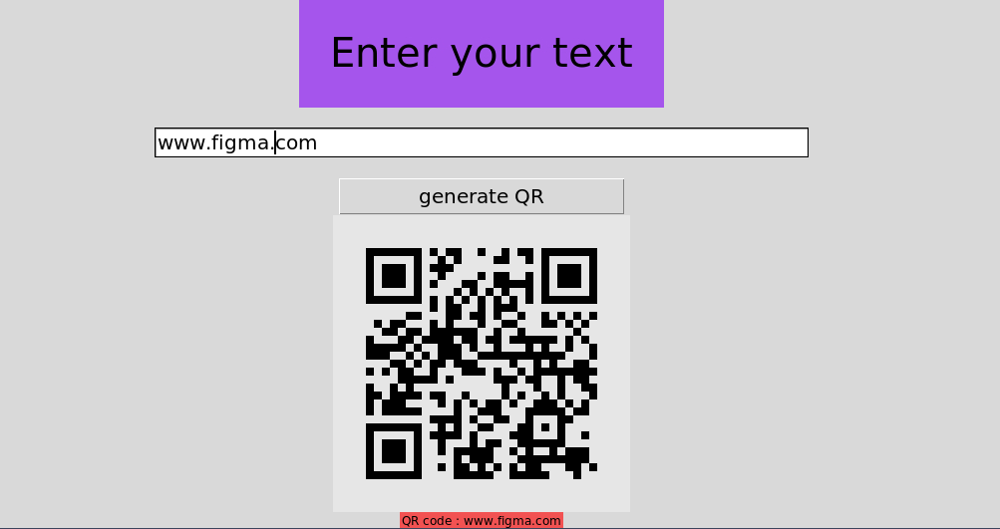

**QR Code Generator**

**GOAL**
create QR code

**DESCRIPTION**
Add text or link as input and when you click on generate button it create QR code.

**WHAT I HAD DONE**
Using tkinter and pyqrcode wrote code 

**LIBRARIES NEEDED**
tkinter, pyqrcode

**DEMONSTRATION**

**YOUR NAME**

Nikunj Rohit
Twitter: @nikunj_rohit10