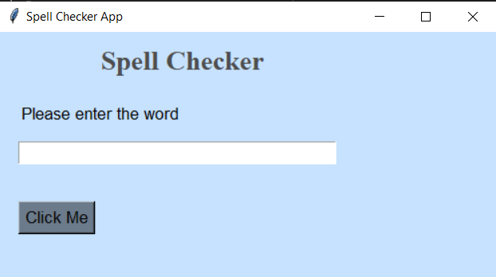
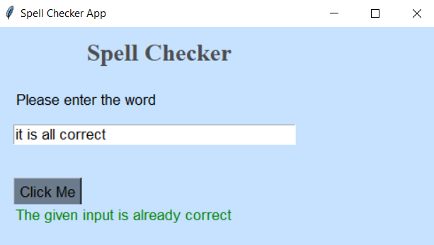

**SPELLING CHECKER**  

**GOAL**  
This is a gui based spelling checker created in python programming language. You can check the spelling of any word or sentence by using this code.

**DESCRIPTION**  
The goal is to check the spelling of any word or sentence by using the user's input and display the result (suggesting the correct spelling) based on the user's input.

To use this code download spellingCheckerGUI.py and resources in the same directory.
+ Open and run the file spellingCheckerGUI.py
+ enjoy the code :-D

**WHAT I HAD DONE**  
In this code, I implemented the code by using the following concepts:
+ Tkinter module
+ spellchecker module

**DEMONSTRATION**  

I wish you enjoy this code :-D

**SRIHARI S**