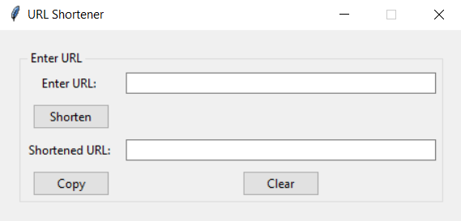
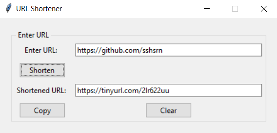

**URL SHORTENER**  

**GOAL**  
This is a url shortener created in python programming language. You can shorten any url and get the shortened url.

**DESCRIPTION**  
The goal is to create a url shortener based on the user's input.

To use this code download urlShortenerGUI.py and resources in the same directory.

**WHAT I HAD DONE**  
In this code, I implemented the code by using the following concepts:
+ Tkinter module
+ pyshorteners module

**DEMONSTRATION**  

I wish you enjoy this code :-D

**SRIHARI S**
