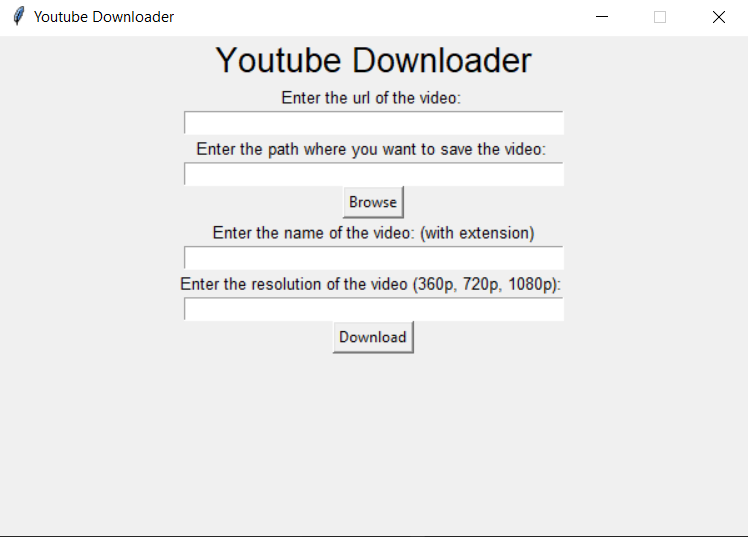
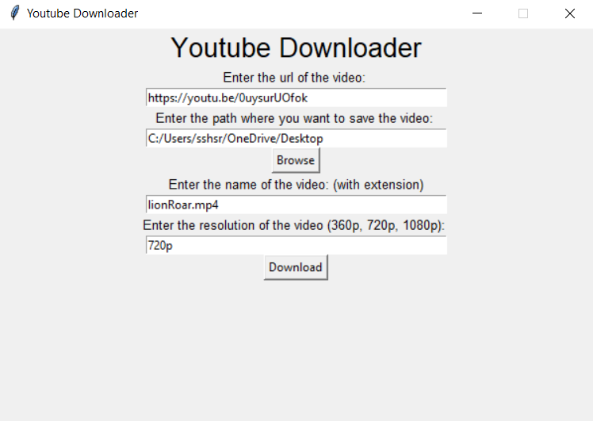
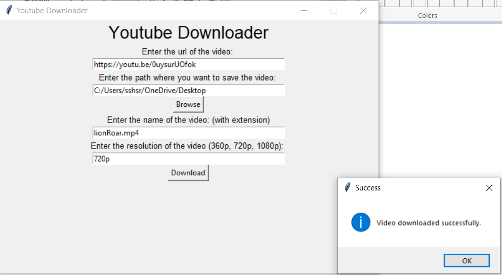
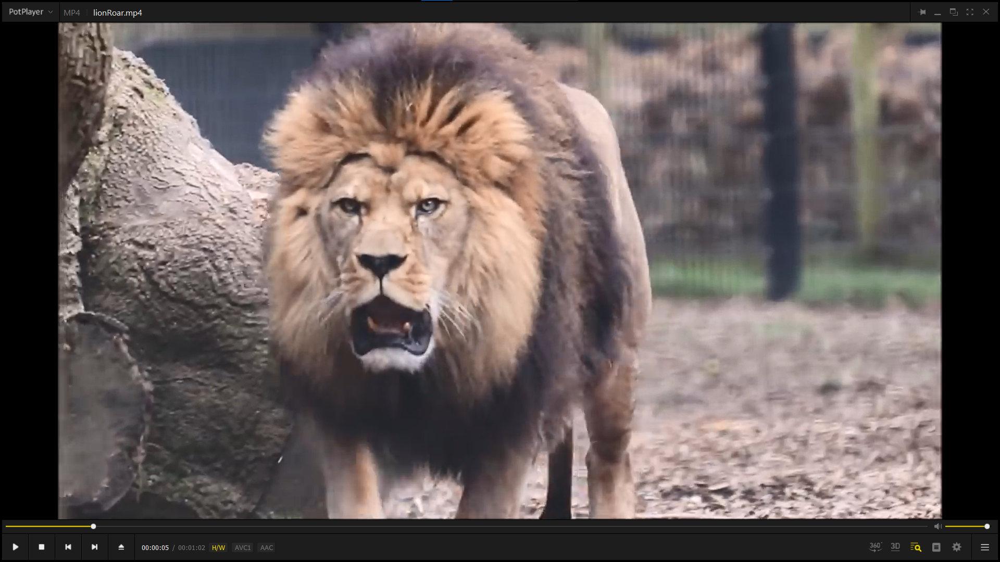

**YOUTUBE DOWNLOADER**  

**GOAL**  
This is a gui based youtube downloader created in python programming language. You can download any youtube video by using this code.

**DESCRIPTION**  
The goal is to download any youtube video by using the youtube video url and save it in the local machine based on the user's input.

To use this code download youtubeDownloaderGUI.py and resources in the same directory.
+ Open and run the file youtubeDownloaderGUI.py
+ enjoy the code :-D

**WHAT I HAD DONE**  
In this code, I implemented the code by using the following concepts:
+ Tkinter module
+ pytube module
+ os module

**DEMONSTRATION**  

I wish you enjoy this code :-D

**SRIHARI S**
