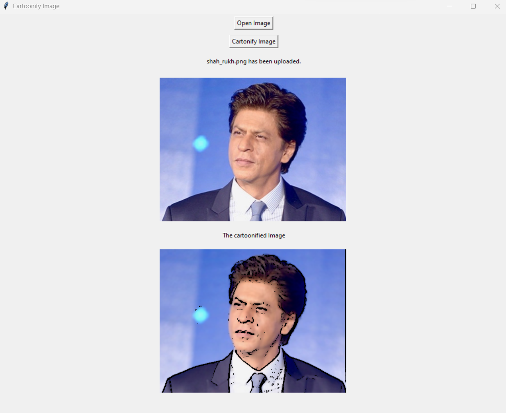
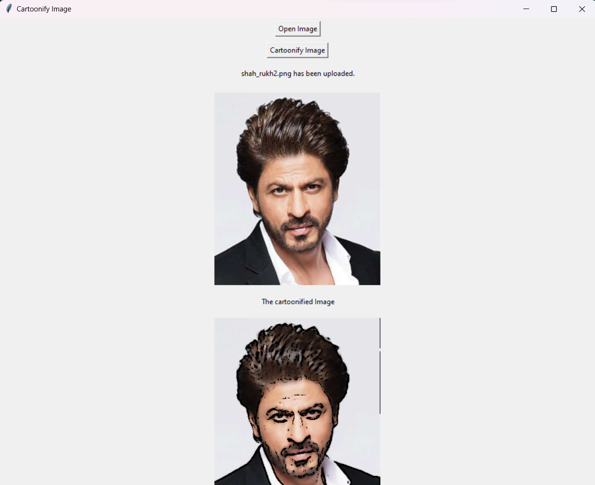

# CARTOONIFY IMAGE

# GOAL

This is a Python program to convert an image to cartoon.

# DESCRIPTION

This Python program converts and uploaded image into a cartoon version of the image.It uses OpenCv to achieve this.

## How to use:
+ Run the program
+ Click on Open Image and select any image from the file dialog box.
+ Click the Cartoonify Image button to turn the image into a cartoon
+ Close the window

# WHAT I HAD DONE

The program is written in python.
It accepts a image using Tkinter Filedialog.The original image is then displayed using PIL and Tkinter.The image is then processed and cartoonified by using the opencv module amd numpy.The cartoonified image is then displayed using PIL and Tkinter.

# LIBRARIES NEEDED
+ Tkinter
+ OpenCV
+ PIL
+ Numpy

# INSTALLATION
+ Tkinter is built into python, so installation is not required
+ pip install opencv-python
+ pip install Pillow
+ Numpy - It is automatically installed when you install OpenCV 

# DEMONSTRATION 
1.
2.

Video Demonstration:

NAME:B C SAMRUDH
GITHUB:https://github.com/bcsamrudh