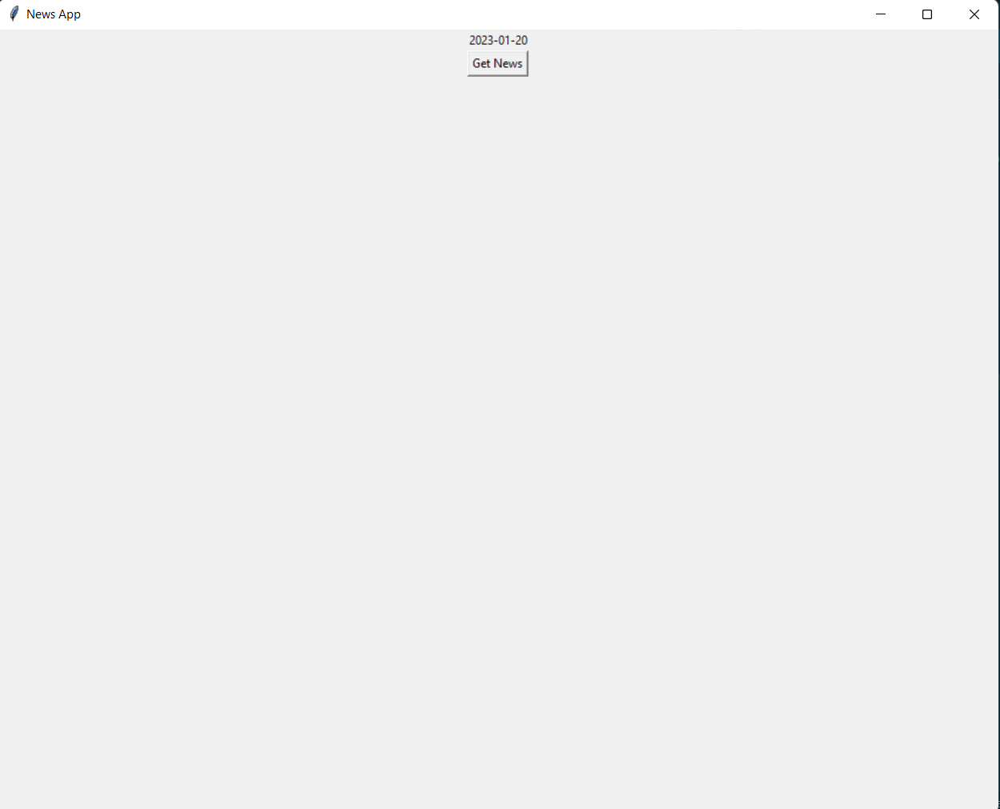
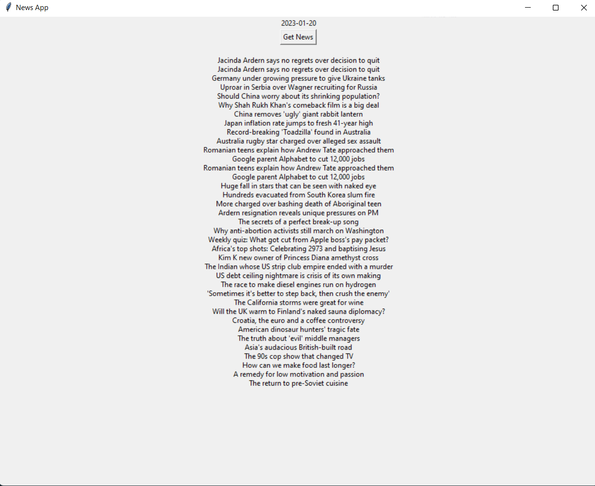

**A NEWS APP**

**GOAL**

To Create a News App 

**DESCRIPTION**

It is a simple python script to extract news from the web through web scrapping

PLEASE MAKE SURE THAT YOU ARE CONNECT TO THE INTERNET or
else you wont be able to get the news.

**WHAT I HAD DONE**

Download beautifulsoup4 from  terminal using the command "pip install beautifulsoup4"

STEPS:

1.Imported the required libraries

2.Created a Tkinter window

3.Defined a function get_news() that get the news from the web using requests and beautifulsoup

4.Cleaned the unwanted data and then presented the news

5.Created the date label and a "Get News" Button

6.Exceptions have been handled

**LIBRARIES NEEDED**

 beautifulsoup4, requests, tkinter, datetime

**DEMONSTRATION**

1.The tkinter window opens with todays date and a button with "Get News" on it

2.When you click the "Get News" button,the news is displayed

**YOUR NAME**

 B C SAMRUDH